# Gare aux vélos !
Projet Gare Remix 2015 réalisé par Caroline Bourdeau, Cécile Meauxsoone, Élodie Ginest, Philippe Cazeneuve, Manuel Duchamp, Christophe Abrassart & Kévin Vennitti

## Le dispositif

Deux usagers de la gare grimpent sur ce dispositif détournant deux vélos placés dans l’espace Ourà de la gare Saint-Paul. Qu’ils se connaissent ou non, ils doivent échanger et se coordonner pour pédaler ensemble afin de progresser dans un jeu insolite et ludique, semé d’obstacles et de contraintes. Mais attention ! Si l’un(e) pédale trop vite, les deux joueurs vont dans le mur ! Les vélos dormaient, les voilà réveillés pour des rencontres sociales inattendues ! Pour corser les choses, les autres usagers de la gare peuvent aussi participer au jeu en modifiant le parcours, via un hashtag sur Twitter. La durée de la partie est synchronisée avec les horaires des trains. Souriez en fin de partie, car l’œil de la Vidéo-dérision immortalise cette flânerie à vélo au cœur du Vieux Lyon. Et vive la vélorution !

Archive du projet & photos :
http://garemixsaintpaul.grandlyon.com/index.php/les-aboyeurs/

**Note** : Ici est archivé la partie numérique / technique du dispositif, à vous d'entreprendre la réalisation des supports fixes des deux vélos et de l'espace de projection. ;)

## Matériel électronique requis

  * 1 carte Arduino (testé avec `Uno`) et son câble USB
  * 1 Breadboard
  * 2 capteurs de lumière
  * 2 résistances 220Ω
  * 6 petits câbles électriques (pour être confortable sur la Breadboard)
  * 4 longs câbles électriques (pour relier les capteurs des vélos à la carte Arduino)
  * Fer à souder, étain, scotch isolant

## Configuration & software requis

  * Ordinateur suffisamment puissant (testé avec un MacBook Pro 8Go de RAM)
  * Processing (testé avec `2.2.1`)
  * Arduino (testé avec `1.0.6`)
  * Vidéo-projecteur (ou écran)
  * Câble VGA ou HDMI
  * Multiprises, rallonges
  * 2 néons / lampes de poche / sources lumineuses
  * Scotch

## Montage sur les vélos

Pour récupérer la vitesse relative de chaque vélo, il faut placer un capteur de lumière et une source lumineuse sur la fourche de la roue arrière, ainsi qu'un cache noir sur la moitié de la même roue. Le demi-cache va se placer entre le capteur de lumière et la source lumineuse "une fois sur deux" pour ainsi modifier la valeur numérique envoyée par le capteur de lumière au jeu ; le programme déduit ensuite la vitesse de la roue selon le nombre de "lumière/noir" sur 20 occurrences. 

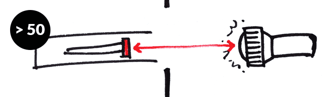

Ci-dessous pas-à-pas les étapes de réalisation au cours de l'événement.
**Note** : ce n'est pas systématiquement la méthode optimale, mais celle-ci a fonctionné. ;) 

### ➜ Le capteur de lumière

Le capteur de lumière capte un grand angle de lumière, et il est difficile de filtrer la luminosité reçue en extérieur (en l'occurrence à la gare, parois vitrées et face à l'extérieur). Le capteur recevait comme valeur en condition éclairée autour de `650` et en condition cachée `550`, ce qui est suffisant mais assez instable (si le soleil se couche, le seuil serait réduit et les données faussées). Il faut donc limiter l'angle du capteur. Puisque je n'avais que peu de matériaux, j'ai opté pour un tube noir placé en prolongement du capteur, afin de réduire la luminosité captée. Et ça a très bien fonctionné ! Les valeurs oscillaient de `> 50` à `0`.

➜ 1 / Récupérer une feuille de papier noir (ou remplir un papier de noir avec un marqueur) de 10cm de longueur au moins sur 5cm de largeur.

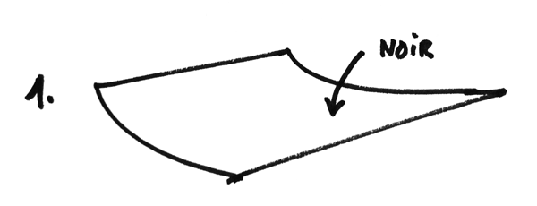

➜ 2 / Enrouler la feuille sur elle-même afin que le noir soit **à l'intérieur** du tube, et de telle manière à ce que le capteur de lumière puisse s'y insérer par l'une des extrémités.

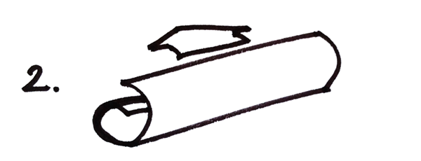

➜ 3 / Fixer la feuille pour que le tube soit solide.

➜ 4 / Sans le tube, le capteur capte trop de luminosité (rouge). Insérer le capteur dans le tube.

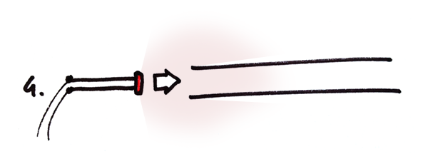

➜ 5 / Avec le tube, le capteur capte beaucoup moins de luminosité (rouge). Centrer le capteur dans le tube, et vérifier les valeurs reçues depuis la console de Arduino pour calibrer au mieux la position du capteur. Lors de l'événement, j'ai laissé 5cm en prolongement du capteur pour obtenir un noir absolu `0` même lorsque le cache se trouvait à 2cm de l'extrémité du tube.

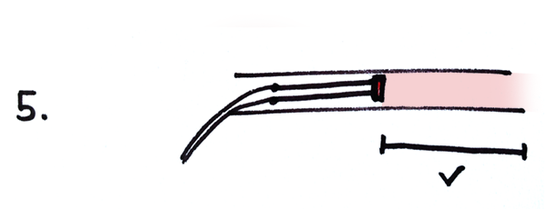

➜ 6 / Enfin, plier à 90° le tube juste avant la tête du capteur afin de pouvoir fixer le tube à la fourche du vélo. Vous pouvez fixer les fils électriques du capteur sur la fourche aussi.

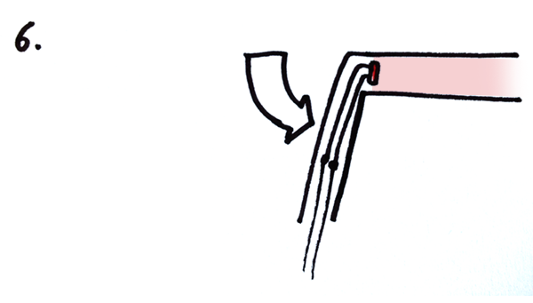

Maintenant, fixer le tube plié à la fourche dans la zone proche du pneu, là où une révolution de roue prendra un temps raisonnable. Veiller à bien diriger la tête du capteur vers l'intérieur de la roue, bien sûr. Si vous placez le capteur trop près de l'axe de rotation, le capteur distinguera beaucoup moins bien le "éclairé/caché" et vous risquez de toucher la chaîne du vélo.

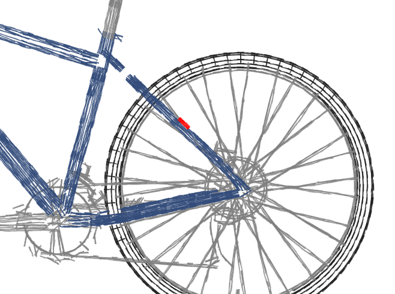
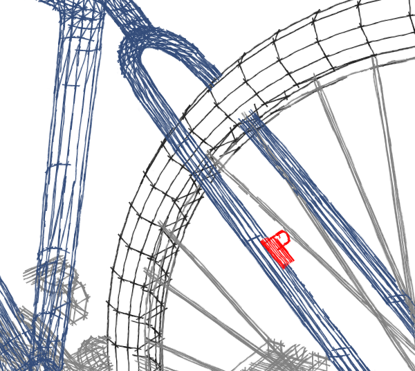

### ➜ La source de lumière

Pour assurer un contraste suffisant entre le caché et l'éclairé, j'ai placé une source lumineuse en face du capteur de lumière, sur l'autre fourche. Ainsi, elle éblouit le capteur lorsqu'il n'y a pas le cache, et est dissimulée derrière le cache noir une moitié de tour de roue.

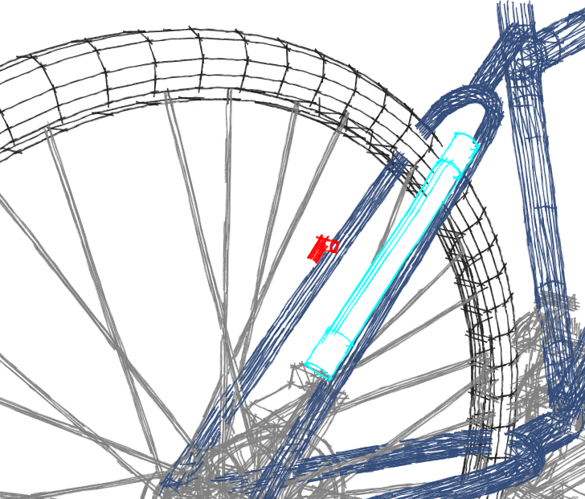

Vérifier que la source de lumière soit bien en face du capteur.

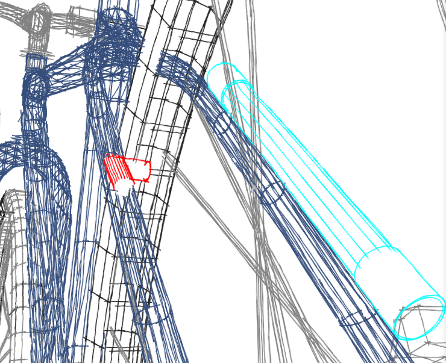

### ➜ Le cache

Enfin, il suffit de rajouter un cache sur la moitié de la roue. Pour information, j'ai tenté de cacher un rayon sur deux (avec donc 8-9 petits caches et 8-9 zones non cachées), mais à moyenne vitesse, le capteur ne distinguait plus assez bien le lumineux du sombre (gris optique, je suppose) : le demi-cache fonctionne très bien. Si vous n'avez rien à disposition, un sac poubelle + scotch fait l'affaire.

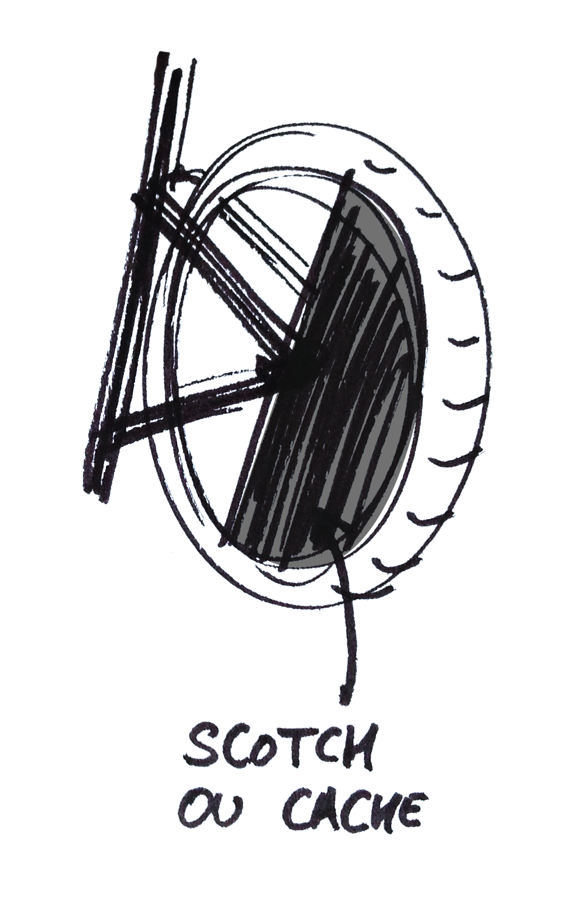

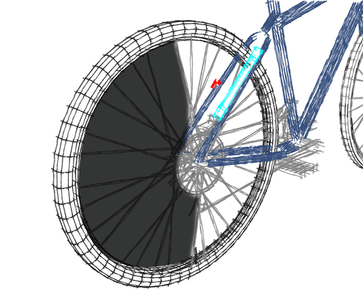

Lors de l'événement, seule une bande a été recouverte, suffisamment large pour cacher le capteur de la source de lumière. La largeur d'un gros ruban adhésif a suffit.

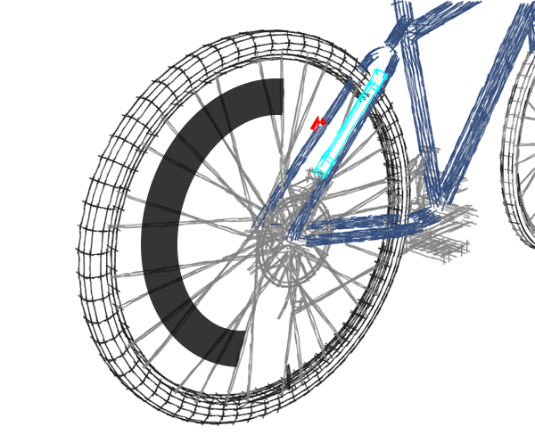

Petit rappel du principe : le cache interceptera la lumière, modifiant ainsi la valeur du capteur de lumière.

### ➜ …et le reste

Maintenant que vous avez équipé un vélo, répéter l'opération avec l'autre vélo (eh oui), puis reliez les fils électriques à la carte Arduino (schéma ci-dessous). Si vous inversez les capteurs, modifiez directement sur la Breadboard plutôt que de tout désinstaller.

Concernant le support des vélos, trouvez un moyen de fixer les vélos à une surface stable (par le guidon ou par la roue avant). Pour faire tourner la roue arrière, 2 rouleaux à pâtisserie détournés ont permis de simuler un sol et une contrainte réelle de pédalage. Le retour principal des joueurs en condition de test a été justement la difficulté à pédaler, car le poids de la personne sur les rouleaux rendaient pénible l'action de pédaler doucement. Dans ce cas, il faudrait expérimenter un support supplémentaire qui surélève légèrement la fourche arrière : les roues touchent donc les 2 rouleaux mais le poids de la personne est soutenu par ce support. Gare aux vélos v2 !

N'oubliez pas de téléverser le code Arduino sur la carte, vérifiez les valeurs reçues en lumière et en caché pour étalonner le code Processing. 

## Schéma Arduino

Vous pouvez économiser des fils ou la Breadboard bien sûr.

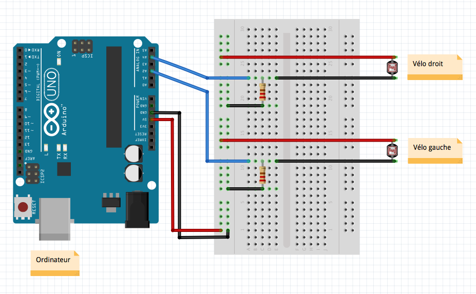

## One more thing

Si vous réutilisez le code Processing, Arduino ou ce DIY décrit, n'hésitez pas à nous envoyer un mail pour qu'on apprécie votre travail ! :)
À très vite : kevin.vennitti@gmail.com

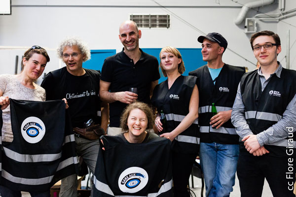
